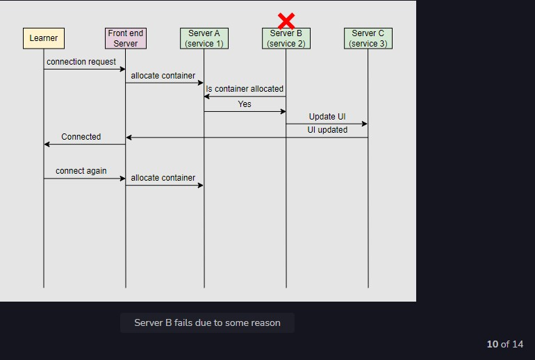

# Introduction to Distributed Monitoring
## Need for monitoring
Let’s go over how the failure of a single service can affect the smooth execution of related systems. To avoid cascading failures, monitoring can play a vital role with early warnings or steering us to the root cause of faults.

Let’s consider a scenario where a user uploads a video, intro-to-system-design, to YouTube. The UI service in server A takes the video information and gives the data to service 2 in server B. Service 2 makes an entry in the database and stores the video in blob storage. Another service, 3, in server C manages the replication and synchronization of databases X and Y.

In this scenario, service 3 fails due to some error, and service 2 makes an entry in the database X. The database X crashes, and the request to fetch a video is routed to database Y. The user wants to play the video intro-to-system-design, but it will give an error of “Video not found…”

The example above is relatively simple. In reality, complex problems are encountered since we have many data centers across the globe, and each has millions of servers. Due to a decreasing human administrators to servers ratio, it’s often not feasible to manually find the problems. Having a monitoring system reduces operational costs and encourages an automated way to detect failures.

### Downtime cost
There are fault-tolerant system designs that hide most of the failures from the end users, but it’s crucial to catch the failures before they snowball into a bigger problem. The unplanned outage in services can be costly. For example, in October 2021, Meta’s applications were down for nearly nine hours, resulting in a loss of around $13 million per hour. Such losses emphasize the potential impact of outages.

The IT infrastructure is spread widely around the globe. The illustration below the next paragraph gives an overview of distributed data centers of major cloud providers across the globe, circa 2021. The data centers are connected through private or public networks. Monitoring the servers in geo-separated data centers is essential.

According to Amazon, on December 7, 2021, “At 7:30 AM PST, an automated activity to scale capacity of one of the AWS services hosted in the main AWS network triggered an unexpected behavior from a large number of clients inside the internal network. This resulted in a large surge of connection activity that overwhelmed the networking devices between the internal network and the main AWS network, resulting in communication delays between these networks. These delays increased latency and errors for services communicating between these networks, resulting in even more connection attempts and retries. This led to persistent congestion and performance issues on the devices connecting the two networks.” According to one estimate, the outage cost of Amazon was $66,240 per minute.

### Types of monitoring
Let’s consider an example to understand the types of errors we want to monitor. At Educative, whenever a learner connects to an executable environment, a container is assigned. Consider service 1 in server A, which is responsible for allocating a container whenever a learner connects. Another service, 2 on server B takes this information and informs the service responsible for UI. The UI service running in server C updates the UI for the learner. Let’s assume that service 2 fails because of some error, and the learner sees the error of “Cannot connect…”

How do the Educative developers find out that a learner is facing this error?

Now, what if a learner makes a request and it never reaches the servers of Educative. How will Educative know that a learner is facing an issue?

With the above examples, we can divide our monitoring focus into two broad categories of errors:

- Service-side errors: These are errors that are usually visible to monitoring services as they occur on servers. Such errors are reported as error 5xx in HTTP response codes.

- Client-side errors: These are errors whose root cause is on the client-side. Such errors are reported as error 4xx in HTTP response codes. Some client-side errors are invisible to the service when client requests fail to reach the service.

We’ll explore how to design a monitoring service to handle both scenarios in the upcoming chapter Monitoring Server-side Errors and Monitoring Client-side Errors. We want our monitoring systems to analyze our globally distributed services. It allows a better understanding of the system’s components and agility to detect and respond to faults.

## How will we design a distributed monitoring system?
We’ve divided the distributed monitoring system design into the following chapters and lessons:

1. Distributed Monitoring
- [Introduction to Distributed Monitoring](../Introduction%20to%20Distributed%20Monitoring/): Learn why monitoring in a distributed system is crucial, how costly downtime is, and the types of monitoring.
- [Prerequisites for a Monitoring System](../System%20Design%20Distributed%20Monitoring/): Explore a few essential concepts about metrics and alerting in a monitoring system.
2. [Monitoring Server-side Errors](../../Monitor%20Server-side%20Errors/Design%20of%20a%20Blob%20Store/)
- [Designing a Monitoring System](../../Monitor%20Server-side%20Errors/Design%20of%20aa%20Blob%20Store/): Define the requirements and high-level design of the monitoring system.
- [A Detailed Design of the Monitoring System](../../Monitor%20Server-side%20Errors/Detailed%20Design%20of%20a%20Monitoring%20System/): Go into the details of designing a monitoring system, and explore the components involved.
- [Visualize Data in a Monitoring System](../../Monitor%20Server-side%20Errors/Visualize%20Data%20in%20a%20Monitoring%20System/): Learn a unique way to visualize an enormous amount of monitoring data.
3. [Monitor Client-side Errors](../../Monitor%20Client-side%20Errors/Focus%20on%20Client-side%20Errors%20in%20a%20Monitoring%20System/)
- [Focus on Client-side Errors](../../Monitor%20Client-side%20Errors/Focus%20on%20Client-side%20Errors%20in%20a%20Monitoring%20System/): Get introduced to client-side errors and why it’s important to monitor them.
- [Design a Client-side Monitoring System](../../Monitor%20Client-side%20Errors/Design%20of%20a%20Client-side%20Monitoring%20System/): Learn to design a system that monitors the client-side errors.

In the next lesson, we’ll look at why monitoring is essential in a distributed system through an example. We’ll also look at the downtime cost of failures and monitoring types.
